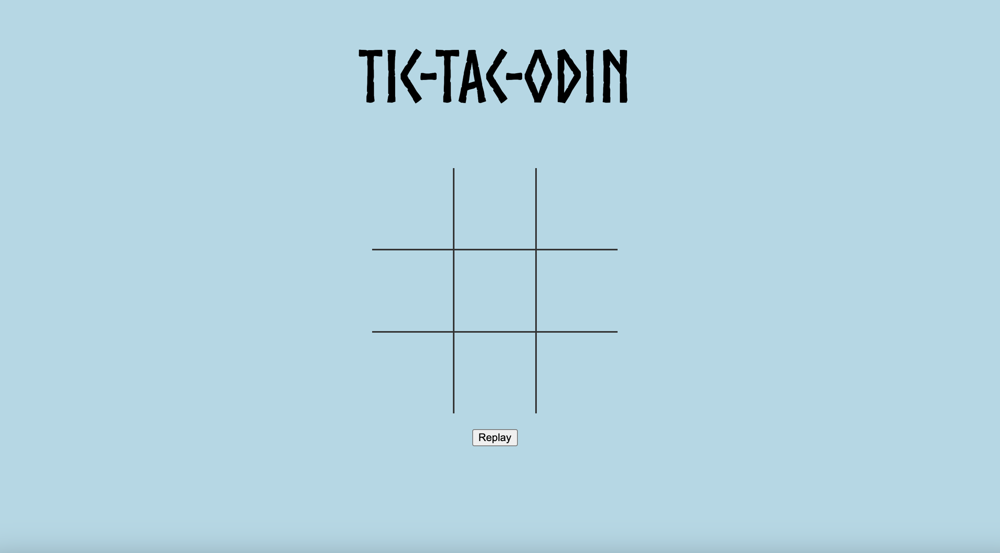
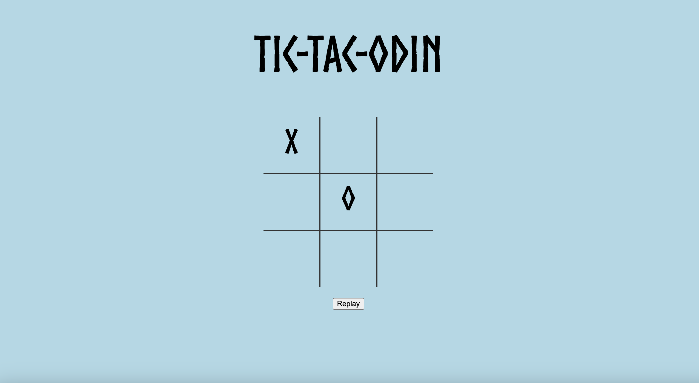
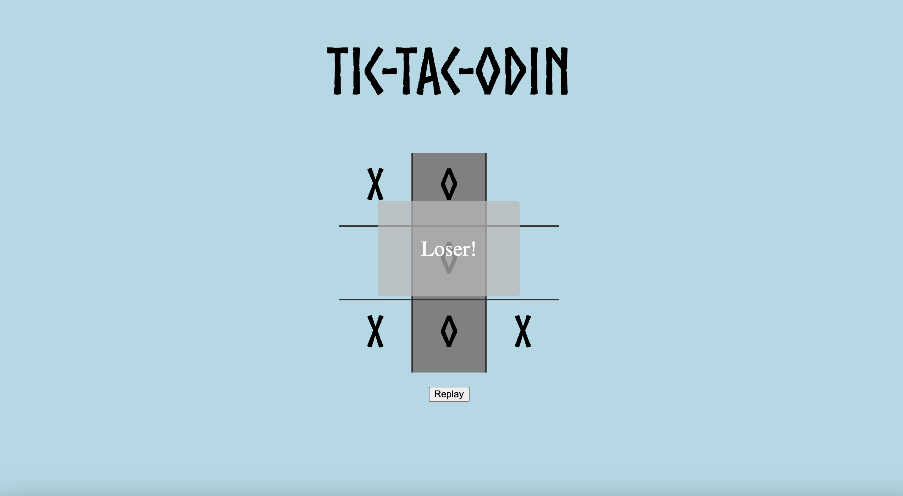
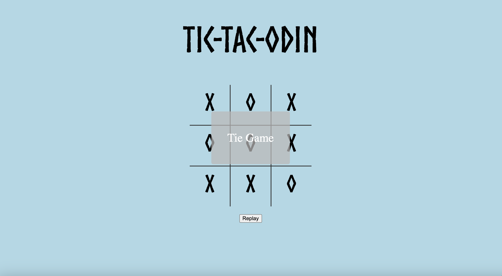

# Tic Tac Toe
## Project 9: Tic Tac Toe Game Built Using JavaScript, CSS, and HTML

## Description: 
Welcome to my ninth web development project! This is part of my coursework in The Odin Project, a free, open-source curriculum to learn fullstack web development! 

This project was built in JavaScript, CSS, and HTML! 

The task for this project was to build a Tic Tac Toe Game. To reduce global scope, I put much of my code inside of an IIFE. For code reusability, I created players using a factory function. I used a minimax algorithm for the computer player. I hope you enjoy! 

## Links:
The full challenge description can be found here: https://www.theodinproject.com/lessons/node-path-javascript-tic-tac-toe. 

## Screenshots: 

